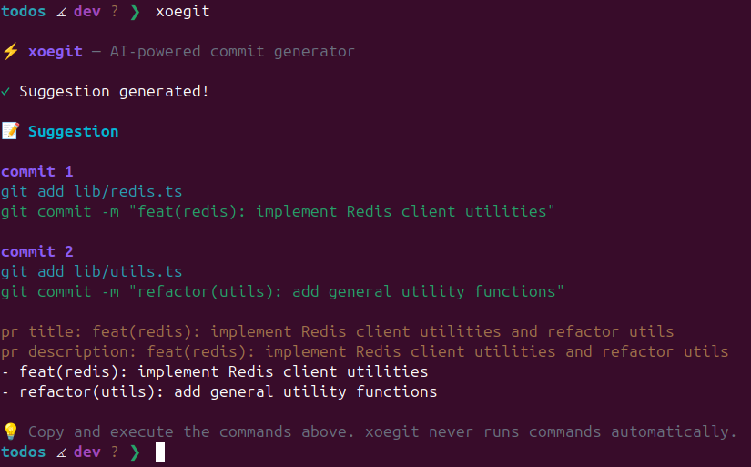

# xoegit

[](https://nodejs.org/)
[](https://www.typescriptlang.org/)
[](https://ai.google.dev/)
[](https://www.npmjs.com/package/xoegit)
[](https://github.com/ujangdoubleday/xoegit/blob/main/LICENSE.md)

**xoegit** is an AI-powered CLI tool that generates concise, semantic, and atomic git commit messages and PR descriptions. It analyzes your `git diff`, `git status`, and `git log` to provide context-aware suggestions powered by Google's Gemini models.

> **Philosophy:** "Craft, Don't Code" — `xoegit` suggests commands; YOU execute them. You stay in control.

## Features

- **Atomic Commits** — Automatically suggests splitting large changes into multiple logical commits
- **Context Aware** — Provide context with `--context` for more accurate commit messages
- **Smart Fallback** — Automatically switches between Gemini models when rate limits are hit
- **Semantic Commits** — Strictly follows [Conventional Commits](https://www.conventionalcommits.org/)
- **PR Ready** — Generates ready-to-use PR title and description

## How It Works

> **Important:** `xoegit` **never** stages your files, commits your changes, or modifies your repository in any way. It only analyzes your changes and provides recommendations that you can review and execute yourself.

You remain in full control of your git workflow.

## Installation

### Prerequisites

- **Node.js**: Minimum version 20.19.5 or higher
- **Git**: Must be installed and available in your PATH
- **API Key**: A Google Gemini API key ([get one here](https://aistudio.google.com/))

### Install

```bash
npm install -g xoegit
```

**or** install from source:

```bash
git clone git@github.com:ujangdoubleday/xoegit.git
cd xoegit
make
```

## Configuration

Simply run `xoegit` for the first time. It will prompt you for your API Key securely and save it locally.

> **Security Note:** Your API key is stored locally on your device only. We do not collect, store, or have access to your API key. See [Security Policy](SECURITY.md) for details.

## Usage

Then, from whatever project you're working on, just run:

```bash
xoegit
```



### Options

| Option                 | Description                                   |
| ---------------------- | --------------------------------------------- |
| `-k, --api-key <key>`  | Use specific API key for this session         |
| `-c, --context <text>` | Provide context for more accurate suggestions |
| `-s, --set-key <key>`  | Save API key to config
| `-d, --delete-key`     | Delete saved API key from config              |
| `-V, --version`        | Show version                                  |
| `-h, --help`           | Show help                                     |

### Examples

**Basic usage:**

```bash
xoegit
```

**With context for better commit type detection:**

```bash
xoegit --context "refactoring folder structure"
xoegit -c "fixing authentication bug"
xoegit -c "adding new payment feature"
```

**Use API key for this session only (not saved):**

```bash
xoegit --api-key "YOUR_GEMINI_API_KEY"
```

**Manage API key:**

```bash
xoegit --set-key "YOUR_GEMINI_API_KEY"
xoegit --delete-key
```

### Sample Output

```
xoegit — AI-powered commit generator

Suggestion generated!

commit 1
git add src/auth/login.ts
git commit -m "feat(auth): add login validation"

commit 2
git add src/utils/logger.ts
git commit -m "refactor(utils): improve error logging"

pr title: feat(auth): implement secure login
pr description: feat(auth): implement secure login
- feat(auth): add login validation
- refactor(utils): improve error logging
```

## Troubleshooting

### "Current directory is not a git repository"

- Ensure you're inside a valid git repo (`git init`)

### "No changes detected"

- Make sure you have modified, staged, or untracked files

## Development

```bash
# Install dependencies
npm install

# Build
npm run build

# Run tests
npm test
```

**or** use `make`:

```bash
make
```

## Project Structure

```
src/
├── cli/           # CLI program and actions
├── config/        # Configuration management
├── git/           # Git operations
├── prompts/       # AI prompt templates
├── providers/     # Gemini AI integration
├── types/         # TypeScript types
└── utils/         # Utilities (input, UI)
```

## Contributing

Contributions are welcome! Please read our [Contributing Guide](CONTRIBUTING.md) to get started.

- [Contributing Guide](CONTRIBUTING.md)
- [Code of Conduct](CODE_OF_CONDUCT.md)
- [Security Policy](SECURITY.md)

## License

[MIT](LICENSE.md)
