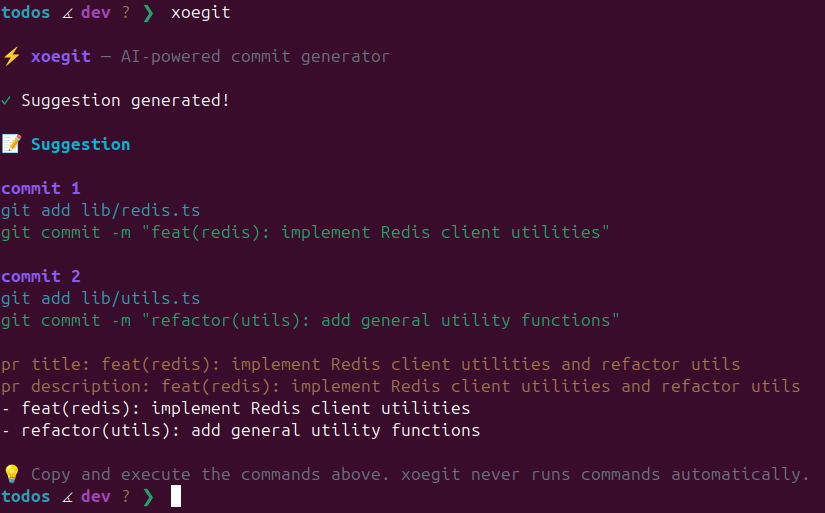

# xoegit

[](https://nodejs.org/)
[](https://www.typescriptlang.org/)
[](https://ai.google.dev/)
[](https://www.npmjs.com/package/xoegit)
[](https://github.com/ujangdoubleday/xoegit/blob/main/LICENSE.md)


**xoegit** is an AI-powered CLI tool that generates concise, semantic, and atomic git commit messages and PR descriptions. It analyzes your `git diff`, `git status`, and `git log` to provide context-aware suggestions. It works with Google Gemini (the default), OpenAI, Anthropic Claude, OpenRouter, and local models through Ollama.

> **Philosophy:** "Craft, Don't Code" — `xoegit` suggests commands; YOU execute them. You stay in control.

## Features

- **Atomic Commits** — Automatically suggests splitting large changes into multiple logical commits
- **Execute Mode** — Optionally execute commits with confirmation using `--execute`
- **Context Aware** — Provide context with `--context` for more accurate commit messages
- **Explain Mode** — Learn commit crafting with `--explain` to see reasoning behind each grouping
- **Smart Fallback** — Automatically switches between Gemini models when rate limits are hit
- **Semantic Commits** — Strictly follows [Conventional Commits](https://www.conventionalcommits.org/)
- **PR Ready** — Generates ready-to-use PR title and description
- **Encrypted Storage** — API keys are automatically encrypted using AES-256-GCM

## How It Works

> **Important:** By default, `xoegit` **never** stages your files, commits your changes, or modifies your repository in any way. It only analyzes your changes and provides recommendations that you can review and execute yourself.
>
> With the `--execute` flag, you can optionally let `xoegit` execute the suggested commits after your explicit confirmation.

You remain in full control of your git workflow.

## Installation

### Prerequisites

- **Node.js**: Minimum version 20.19.5 or higher
- **Git**: Must be installed and available in your PATH
- **API Key**: An API key for your chosen provider. Gemini is the default ([get one here](https://aistudio.google.com/)); Ollama runs locally and needs no key.

### Quick Start

```bash
npx xoegit
```

### Global Installation (Optional)

```bash
npm install -g xoegit
```

### Install from Source 

```bash
git clone git@github.com:ujangdoubleday/xoegit.git
cd xoegit
make
```

## Configuration

The first time you run `xoegit` with no key configured, an interactive **setup wizard** walks you through:

1. **Provider** — pick Gemini, OpenAI, Anthropic, OpenRouter, or Ollama.
2. **Endpoint** — only for Ollama/OpenRouter (press Enter to keep the default).
3. **Model** — press Enter to keep the provider default, or type another model name.
4. **API key** — skipped for Ollama (it needs no key).

Everything you choose is saved locally, so the **next run reuses your provider, model, and key automatically** — no need to paste the key again. To switch providers later, run once with `--provider <name>` (the choice is remembered), or re-run the wizard after deleting your key with `--delete-key`.

> **Security Note:** Your API key is stored locally and encrypted using AES-256-GCM. We do not collect, store, or have access to your API key. See [Security Policy](SECURITY.md) for details.

### AI Providers

| Provider     | Default model      | API key required | Get a key                                            |
| ------------ | ------------------ | ---------------- | ---------------------------------------------------- |
| `gemini`     | `gemini-2.5-flash-lite` | Yes         | <https://aistudio.google.com/>                       |
| `openai`     | `gpt-4.1-mini`     | Yes              | <https://platform.openai.com/api-keys>               |
| `anthropic`  | `claude-sonnet-4-20250514` | Yes      | <https://console.anthropic.com/settings/keys>        |
| `openrouter` | `openrouter/auto`  | Yes              | <https://openrouter.ai/keys>                         |
| `ollama`     | `llama3.2`         | No (local)       | —                                                    |

Only **Gemini** automatically falls back to other Gemini models when it hits a rate limit (429). For `openrouter`, the default `openrouter/auto` lets OpenRouter pick a suitable model for you.

### Environment variables

Every setting follows the order **env var → config file → default**, so you can override config without editing it:

| Variable                      | Purpose                                              |
| ----------------------------- | ---------------------------------------------------- |
| `XOEGIT_PROVIDER`             | Default provider                                     |
| `XOEGIT_<PROVIDER>_API_KEY`   | API key (e.g. `XOEGIT_GEMINI_API_KEY`)               |
| `XOEGIT_<PROVIDER>_MODEL`     | Model override (e.g. `XOEGIT_OPENAI_MODEL`)          |
| `XOEGIT_OLLAMA_BASE_URL`      | Ollama endpoint (default `http://localhost:11434`)   |
| `XOEGIT_OPENROUTER_BASE_URL`  | OpenRouter endpoint                                  |

## Usage

From any git repository, just run:

```bash
npx xoegit
```

**or** if installed globally:

```bash
xoegit
```



### Options

| Option                   | Description                                                            |
| ------------------------ | --------------------------------------------------------------------- |
| `-p, --provider <name>`  | AI provider: `gemini` (default), `openai`, `anthropic`, `openrouter`, `ollama` |
| `-m, --model <model>`    | Override the model for the selected provider                          |
| `-k, --api-key <key>`    | Use a specific API key for this session                               |
| `-c, --context <text>`   | Provide context for more accurate suggestions                        |
| `-e, --execute`          | Execute commits after confirmation prompt                            |
| `--explain`              | Show reasoning behind each commit grouping                           |
| `--report <period>`      | Generate a progress report from git log (e.g. `NOW`, `3D`, `4W`, `2M`) |
| `--lang <code>`          | Report language (e.g. `en`, `id`, `ja`); defaults to `en`            |
| `-s, --set-key <key>`    | Save the API key for the selected provider to config                 |
| `-d, --delete-key`       | Delete the saved API key for the selected provider                   |
| `-V, --version`          | Show version                                                         |
| `-h, --help`             | Show help                                                            |

### Examples

**Basic usage:**

```bash
npx xoegit
```

**With context for better commit type detection:**

```bash
npx xoegit --context "refactoring folder structure"
npx xoegit -c "fixing authentication bug"
npx xoegit -c "adding new payment feature"
```

```bash
npx xoegit --api-key "YOUR_GEMINI_API_KEY"
```

**Choose a provider / model:**

```bash
npx xoegit --provider openai                 # switch provider (remembered next time)
npx xoegit --provider openrouter             # OpenRouter (defaults to openrouter/auto)
npx xoegit --provider ollama                 # local models, no API key needed
npx xoegit --provider anthropic --model claude-sonnet-4-20250514
```

**Manage API key:**

```bash
npx xoegit --set-key "YOUR_API_KEY"                    # saves for the default/selected provider
npx xoegit --provider openai --set-key "YOUR_OPENAI_KEY"
npx xoegit --delete-key
```

**Generate a progress report from git log:**

```bash
npx xoegit --report 4W            # last 4 weeks
npx xoegit --report NOW --lang id # today's commits, in Indonesian
```

**Execute mode (auto-commit with confirmation):**

```bash
npx xoegit --execute
npx xoegit -e
npx xoegit -e -c "fixing critical bug"
```

**Explain mode (verbose reasoning):**

```bash
npx xoegit --explain
npx xoegit --explain -c "refactoring auth module"
```

### Sample Output

```
xoegit — AI-powered commit generator

Suggestion generated!

commit 1
git add src/auth/login.ts
git commit -m "feat(auth): add login validation"

commit 2
git add src/utils/logger.ts
git commit -m "refactor(utils): improve error logging"

pr title: feat(auth): implement secure login
pr description: feat(auth): implement secure login
- feat(auth): add login validation
- refactor(utils): improve error logging
```

### Explain Mode Output

```
commit 1
git add src/auth/login.ts src/auth/validator.ts
git commit -m "feat(auth): add login validation"
why: I grouped these files because they both handle authentication logic and the validator is directly used by login.ts.

commit 2
git add package.json package-lock.json
git commit -m "chore: update dependencies"
why: I separated dependency updates from code changes to keep the commit atomic and make it easy to revert if needed.
```

### Execute Mode Output

```
ℹ Execute mode enabled. 2 commit(s) will be created.
Do you want to execute these commands? (y/n): y
✔ [1/2] a1b2c3d feat(auth): add login validation
└─ src/
   └─ auth/
      └─ login.ts
✔ [2/2] e4f5g6h refactor(utils): improve error logging
└─ src/
   └─ utils/
      └─ logger.ts

✓ All 2 commit(s) executed successfully!
```

## Troubleshooting

### "Current directory is not a git repository"

- Ensure you're inside a valid git repo (`git init`)

### "No changes detected"

- Make sure you have modified, staged, or untracked files

## Development

```bash
# Install dependencies
npm install

# Build
npm run build

# Run tests
npm test
```

**or** use `make`:

```bash
make
```

## Project Structure

```
src/
├── cli/           # CLI program and actions
├── config/        # Configuration management
├── git/           # Git operations
├── prompts/       # AI prompt templates
├── providers/     # AI provider integrations (Gemini, OpenAI, Anthropic, OpenRouter, Ollama)
├── types/         # TypeScript types
└── utils/         # Utilities (input, UI)
```

## Contributing

Contributions are welcome! Please read our [Contributing Guide](CONTRIBUTING.md) to get started.

- [Contributing Guide](CONTRIBUTING.md)
- [Code of Conduct](CODE_OF_CONDUCT.md)
- [Security Policy](SECURITY.md)

## License

[MIT](LICENSE.md)
